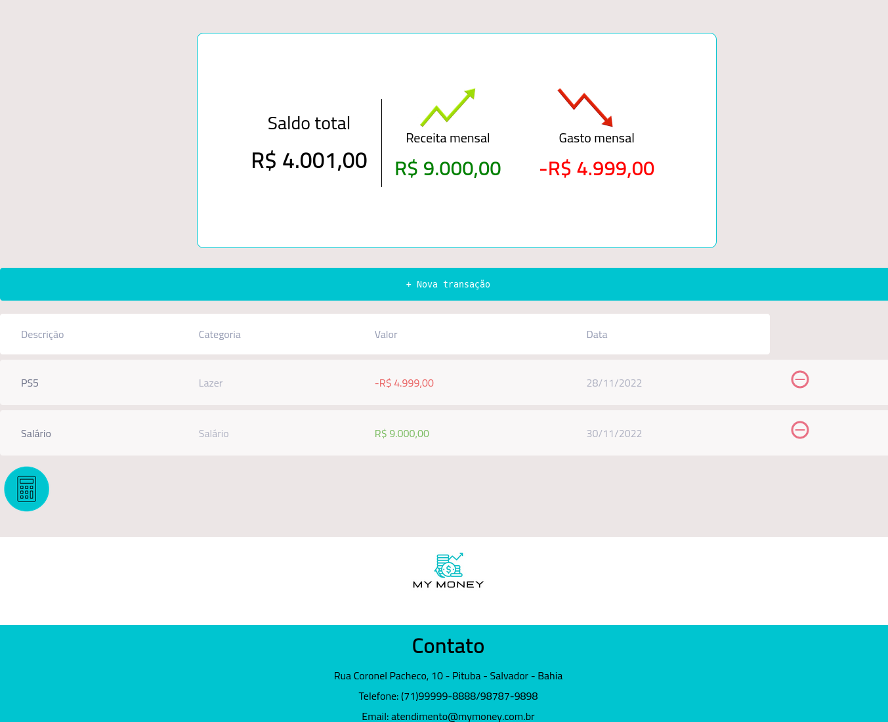

<h1 align="center">💵 My Money</h1> 

  

  

> Desenvolvimento

Esta aplicação foi criada para a Tese de Conclusão de Curso do Curso do Curso de Qualificação Profissional do SENAI CIMATEC - BA

## 🚀 Tecnologias

Esse projeto foi desenvolvido com as seguintes tecnologias:

- HTML
- CSS
- JavaScript:  
  - DOM
  - Orientação a Objetos
  - Local Storage do Navegador

  
## 💻 Projeto

O My Money foi desenvolvido na intenção de ajudar as pessoas na sua educação financeira, mostrando onde cada gasto foi feito e que dia foi feito, disponibilizando um controle maior das finanças.

> [🔗 Clique aqui para acessar o projeto]
(https://mymoneysenai.vercel.app/)

## Licença

Esse projeto está sob a licença MIT.

